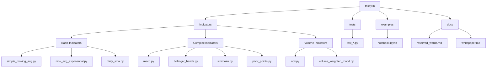

## Support Our Mission
[](https://www.paypal.com/us/fundraiser/charity/5501979)
*Your donation is tax-deductible - we are a 501(c)(3) nonprofit organization.*

## Consultation
[](https://phr-consultation.youcanbook.me/)


# tospylib

**A faithful Thinkscript-to-Python technical indicators library for pandas/numpy.**

- Indicators fully mirror Schwab/TD Thinkscript logic, parameters, and reserved word behavior.
- Built for clarity, licensing review, research, and production.
- Supports multi-timeframe and multi-symbol analysis.

## Project Structure

```
tospylib/
├── tospylib/                  # Main package directory
│   ├── indicators/            # Technical indicator implementations
│   │   ├── adx.py            # Average Directional Index
│   │   ├── bollinger_bands.py # Bollinger Bands
│   │   ├── daily_sma.py      # Daily Simple Moving Average
│   │   ├── ichimoku.py       # Ichimoku Cloud
│   │   ├── macd.py           # Moving Average Convergence Divergence
│   │   ├── mov_avg_exponential.py # Exponential Moving Average
│   │   ├── obv.py            # On-Balance Volume
│   │   ├── pivot_points.py   # Classic Pivot Points
│   │   ├── relative_strength.py # Relative Strength Index
│   │   ├── simple_moving_avg.py # Simple Moving Average
│   │   ├── stochastic_fast.py # Stochastic Fast Oscillator
│   │   └── volume_weighted_macd.py # Volume Weighted MACD
│   ├── indicator_utils.py    # Common utility functions
│   └── enums.py              # Enumerations and constants
├── tests/                    # Unit tests for all indicators
├── examples/                 # Usage examples and notebooks
│   └── notebook.ipynb       # Jupyter notebook with examples
├── ohlcv_sample.csv         # Sample data for testing
└── reserved_words.md        # Thinkscript to Python mapping reference
```

## Getting Started

### 🚀 Quick Start Guide

1. **Install the Package**
   ```bash
   # Choose one of these installation methods:
   
   # Method 1: From GitHub (recommended)
   pip install git+https://github.com/projecthamburg/tospylib.git
   
   # Method 2: From local clone
   git clone https://github.com/projecthamburg/tospylib.git
   cd tospylib
   pip install -e .
   ```

2. **Run the Example Notebook**
   ```bash
   # Install Jupyter if you haven't already
   pip install jupyter
   
   # Start Jupyter
   jupyter notebook
   
   # Open examples/notebook.ipynb
   ```

3. **Try Basic Examples**
   ```python
   # In your Python environment or notebook:
   import pandas as pd
   from tospylib.indicators.simple_moving_avg import simple_moving_avg
   
   # Load sample data
   df = pd.read_csv('ohlcv_sample.csv', parse_dates=['Date'], index_col='Date')
   
   # Calculate SMA
   df['sma'] = simple_moving_avg(df['Close'], length=20)
   ```

### 🧪 Running Tests

```bash
# Install test dependencies
pip install pytest pytest-cov

# Run all tests
python -m pytest

# Run with coverage report
python -m pytest --cov=tospylib

# Run specific test file
python -m pytest tests/test_macd.py
```

### 📊 Data Requirements

The library expects pandas DataFrames or Series with:
- DateTime index for time series data
- Standard OHLCV columns (Open, High, Low, Close, Volume)
- Numeric data types

Example data structure:
```python
import pandas as pd

# Sample data creation
data = {
    'Open': [100, 101, 102],
    'High': [105, 106, 107],
    'Low': [98, 99, 100],
    'Close': [103, 104, 105],
    'Volume': [1000, 2000, 3000]
}
df = pd.DataFrame(data, index=pd.date_range('2024-01-01', periods=3))
```

### 🔧 Common Operations

1. **Basic Indicator Calculation**
   ```python
   from tospylib.indicators.macd import macd
   
   # Calculate MACD
   macd_result = macd(df['Close'], fast_length=12, slow_length=26, signal_length=9)
   ```

2. **Multi-timeframe Analysis**
   ```python
   from tospylib.indicators.daily_sma import daily_sma
   
   # Calculate daily SMA on minute data
   daily_sma_values = daily_sma(
       calculation_df=df,
       display_df=df,
       price_type="Close",
       length=9
   )
   ```

3. **Visualization**
   ```python
   import matplotlib.pyplot as plt
   
   # Plot MACD
   plt.figure(figsize=(12, 6))
   plt.plot(macd_result['Value'], label='MACD')
   plt.plot(macd_result['Avg'], label='Signal')
   plt.legend()
   plt.show()
   ```

### 🛠️ Development Setup

1. **Clone and Install**
   ```bash
   git clone https://github.com/projecthamburg/tospylib.git
   cd tospylib
   pip install -e .
   pip install -r requirements.txt
   ```

2. **Install Development Tools**
   ```bash
   pip install black isort mypy pytest pytest-cov
   ```

3. **Run Code Quality Checks**
   ```bash
   # Format code
   black .
   
   # Sort imports
   isort .
   
   # Type checking
   mypy .
   ```

### 📚 Where to Find Help

1. **Documentation**
   - `reserved_words.md`: Thinkscript to Python mapping
   - `examples/notebook.ipynb`: Interactive examples
   - Docstrings in each indicator file

2. **Sample Data**
   - `ohlcv_sample.csv`: Sample OHLCV data for testing
   - Examples in the notebook

3. **Testing**
   - `tests/`: Unit tests for all indicators
   - `test_smoke.py`: Basic functionality tests

## Visual Repository Map



## Contributor Onboarding

### Quick Start for New Contributors

1. **Setting Up Development Environment**
   ```bash
   # Clone and install
   git clone https://github.com/projecthamburg/tospylib.git
   cd tospylib
   pip install -e .
   pip install -r requirements.txt
   
   # Install development tools
   pip install pytest black isort mypy
   ```

2. **Where to Find Things**
   - Indicator implementations: `tospylib/indicators/`
   - Tests: `tests/`
   - Examples: `examples/notebook.ipynb`
   - Documentation: `reserved_words.md` and `whitepaper.md`
   - Utility functions: `tospylib/indicator_utils.py`
   - Constants/Enums: `tospylib/enums.py`

3. **Adding a New Indicator**
   ```python
   # 1. Create new file in tospylib/indicators/
   # 2. Follow template:
   """
   Indicator Name
   Thinkscript reference: [ReferenceName]
   For explicit Thinkscript parameter definitions, see ../reserved_words.md.
   """
   import pandas as pd
   
   def new_indicator(param1, param2=default_value, display_index=None):
       """
       Docstring following numpy style
       """
       # Implementation
       pass
   ```

4. **Adding Tests**
   ```python
   # 1. Create test file in tests/
   # 2. Follow template:
   def test_new_indicator():
       # Test basic functionality
       pass
       
   def test_new_indicator_edge_cases():
       # Test edge cases
       pass
   ```

5. **Code Style Guidelines**
   - Use black for formatting
   - Use isort for imports
   - Follow numpy docstring style
   - Add type hints
   - Keep functions focused and small

6. **Testing Your Changes**
   ```bash
   # Run all tests
   python -m pytest
   
   # Run specific test
   python -m pytest tests/test_new_indicator.py
   
   # Run with coverage
   python -m pytest --cov=tospylib
   ```

7. **Documentation Updates**
   - Update `reserved_words.md` if adding new Thinkscript mappings
   - Add examples to `examples/notebook.ipynb`
   - Update docstrings in your indicator file

8. **Submitting Changes**
   ```bash
   # Create feature branch
   git checkout -b feature/new-indicator
   
   # Make changes
   # Run tests
   # Commit changes
   git add .
   git commit -m "Add new indicator: [name]"
   
   # Push and create PR
   git push origin feature/new-indicator
   ```

9. **Common Pitfalls to Avoid**
   - Not following Thinkscript parameter naming
   - Missing type hints
   - Incomplete docstrings
   - No test coverage
   - Not handling edge cases
   - Not updating documentation

10. **Getting Help**
    - Check existing issues
    - Review `whitepaper.md` for design decisions
    - Look at similar indicators for patterns
    - Ask in issues/discussions

## Installation Options

### 🟢 1. Local Development Install (Editable)
For developers who want to modify the code:

```bash
# Clone the repository
git clone https://github.com/projecthamburg/tospylib.git
cd tospylib

# Install in editable mode
pip install -e .

# Install development dependencies
pip install -r requirements.txt
```

### 🟦 2. Direct Install from GitHub
For users who want the latest version:

```bash
pip install git+https://github.com/projecthamburg/tospylib.git
```

### 🟨 3. Install from ZIP
For users without Git:

1. Download the ZIP from GitHub (Code → Download ZIP)
2. Unzip the file
3. Open terminal in the unzipped folder
4. Run:
   ```bash
   pip install .
   ```

## Usage Examples

### Basic Usage
```python
import pandas as pd
from tospylib.indicators.simple_moving_avg import simple_moving_avg

# Load your data
df = pd.read_csv('ohlcv_sample.csv', parse_dates=['Date'], index_col='Date')

# Calculate indicators
df['sma'] = simple_moving_avg(df['Close'], length=20)
```

### Multi-timeframe Analysis
```python
from tospylib.indicators.daily_sma import daily_sma

# Calculate daily SMA on minute data
daily_sma_values = daily_sma(
    calculation_df=df,
    display_df=df,
    price_type="Close",
    length=9
)
```

### Advanced Usage
```python
from tospylib.indicators.macd import macd
from tospylib.indicators.bollinger_bands import bollinger_bands

# Calculate MACD
macd_result = macd(df['Close'], fast_length=12, slow_length=26, signal_length=9)

# Calculate Bollinger Bands
bands = bollinger_bands(
    df['Close'],
    length=20,
    num_dev_dn=-2.0,
    num_dev_up=2.0
)
```

## Features

- Simple Moving Average (SMA)
- Exponential Moving Average (EMA)
- Bollinger Bands
- MACD
- Stochastic Fast
- ADX
- Ichimoku
- On-Balance Volume (OBV)
- Volume Weighted MACD
- Daily SMA (multi-timeframe)
- Relative Strength (multi-symbol)
- Classic Pivot Points

## Documentation

- `reserved_words.md`: Complete mapping of Thinkscript to Python functions
- `examples/notebook.ipynb`: Interactive examples and tutorials
- Docstrings in each indicator file: Detailed parameter descriptions

## Contributing

1. Fork the repository
2. Create a feature branch
3. Make your changes
4. Run tests: `python -m pytest`
5. Submit a pull request

## Testing

```bash
# Run all tests
python -m pytest

# Run specific test
python -m pytest tests/test_macd.py
```

## Disclaimer and Acknowledgment

- **This project is an independent, open research effort and is not affiliated with, sponsored by, or officially endorsed by Charles Schwab & Co., TD Ameritrade, or any associated trademarks or products (including thinkorswim or Thinkscript).**
- References to Thinkscript or related terms are for purposes of technical interoperability and educational documentation only.
- No proprietary code from Schwab/TD/thinkorswim is used; all translations to Python are original or based solely on public documentation.

If you are a rights holder and wish to discuss attribution or usage, please contact Project Hamburg Research Inc.

[](LICENSE)

© 2025 Project Hamburg Research Inc.  
*Legacy Code Preservation Charter Project: Thinkscript to Python translation for open research, public good, and LLM accessibility.*
