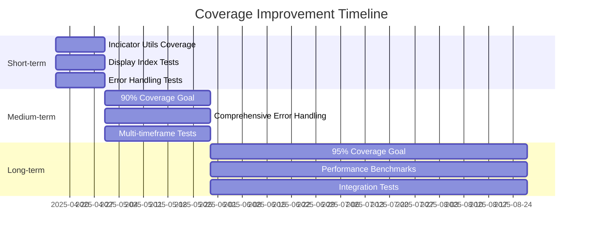

# 🧪 TospyLib Test Report

[](TEST_REPORT.md)
[](TEST_REPORT.md)
[](TEST_REPORT.md)
[](TEST_REPORT.md)

> This report provides a comprehensive analysis of the current test coverage for the TospyLib project, identifying key areas for improvement and prioritizing action items.

## 📊 Summary

<table>
<tr>
<th>Metric</th>
<th>Value</th>
</tr>
<tr>
<td><strong>Total Tests</strong></td>
<td>18</td>
</tr>
<tr>
<td><strong>Passed</strong></td>
<td>18 ✅</td>
</tr>
<tr>
<td><strong>Failed</strong></td>
<td>0 ✅</td>
</tr>
<tr>
<td><strong>Overall Coverage</strong></td>
<td>82% 🟡</td>
</tr>
<tr>
<td><strong>Total Lines</strong></td>
<td>285</td>
</tr>
<tr>
<td><strong>Lines Covered</strong></td>
<td>233</td>
</tr>
<tr>
<td><strong>Lines Missing</strong></td>
<td>52 ⚠️</td>
</tr>
</table>

## 🔬 Detailed Coverage Analysis

### Module-by-Module Coverage Breakdown

<div style="background-color: #fff0f0; padding: 15px; border-left: 4px solid #ff6b6b; border-radius: 4px; margin-bottom: 20px;">
<h4>1. Indicator Utils <span style="color: red;">(Critical Priority)</span> 🚨</h4>
<ul>
<li><strong>Coverage:</strong> 54% (Lowest in project)</li>
<li><strong>Missing Lines:</strong> 8-15, 24, 33-45, 49-54, 74-77, 81-83</li>
<li><strong>Impact:</strong> High (Core functionality)</li>
<li><strong>Priority:</strong> Immediate</li>
</ul>
<details>
<summary><strong>Missing Coverage Types</strong></summary>
<ul>
<li>Error handling paths (8-15)</li>
<li>Edge case scenarios (33-45)</li>
<li>Utility function variations (74-77)</li>
<li>Input validation (81-83)</li>
</ul>
</details>
</div>

<div style="background-color: #fff8e6; padding: 15px; border-left: 4px solid #ffa94d; border-radius: 4px; margin-bottom: 20px;">
<h4>2. Display Index Functionality <span style="color: orange;">(High Priority)</span> ⚠️</h4>
<strong>Affected Modules:</strong>
<ul>
<li>ADX (75-77)</li>
<li>Bollinger Bands (45-47)</li>
<li>Ichimoku (35)</li>
<li>Simple Moving Average (20)</li>
<li>Exponential Moving Average (32)</li>
<li>Volume Weighted MACD (31)</li>
</ul>
<details>
<summary><strong>Common Issues</strong></summary>
<ul>
<li>Missing reindexing tests</li>
<li>Incomplete display_index parameter validation</li>
<li>Edge case handling for different index types</li>
</ul>
</details>
</div>

<div style="background-color: #f0f8ff; padding: 15px; border-left: 4px solid #4dabf7; border-radius: 4px; margin-bottom: 20px;">
<h4>3. Error Handling <span style="color: blue;">(Medium Priority)</span> ℹ️</h4>
<strong>Affected Modules:</strong>
<ul>
<li>Daily SMA (24-25)</li>
<li>OBV (40, 43)</li>
<li>Pivot Points (47, 64)</li>
<li>Relative Strength (46)</li>
</ul>
<details>
<summary><strong>Missing Coverage</strong></summary>
<ul>
<li>Invalid input handling</li>
<li>Edge case scenarios</li>
<li>Exception handling paths</li>
</ul>
</details>
</div>

### Coverage Improvement Targets



<table style="width: 100%;">
<tr>
<th>Timeframe</th>
<th>Goals</th>
<th>Target Date</th>
</tr>
<tr>
<td><strong>Short-term</strong><br>(Next 2 weeks)</td>
<td>
<ul>
<li>Increase Indicator Utils coverage to >80%</li>
<li>Add display_index tests for all indicators</li>
<li>Implement basic error handling tests</li>
</ul>
</td>
<td>April 30, 2025</td>
</tr>
<tr>
<td><strong>Medium-term</strong><br>(Next month)</td>
<td>
<ul>
<li>Achieve >90% coverage for all modules</li>
<li>Add comprehensive error handling</li>
<li>Implement multi-timeframe tests</li>
</ul>
</td>
<td>May 16, 2025</td>
</tr>
<tr>
<td><strong>Long-term</strong><br>(Next quarter)</td>
<td>
<ul>
<li>Maintain >95% coverage</li>
<li>Add performance benchmarks</li>
<li>Implement integration tests</li>
</ul>
</td>
<td>July 16, 2025</td>
</tr>
</table>

---

## 🔄 Recent Updates and Fixes

### Critical Fixes

<div style="display: grid; grid-template-columns: 1fr 1fr; gap: 15px; margin-bottom: 20px;">
    <div style="border: 1px solid #ddd; border-radius: 5px; padding: 10px;">
        <h4>1. ADX Implementation ✅</h4>
        <ul>
            <li>Fixed column names (<code>+DI</code>/<code>-DI</code>)</li>
            <li>Added NaN handling</li>
            <li>Updated test assertions</li>
            <li><strong>Impact:</strong> High (Fixed core functionality)</li>
        </ul>
    </div>
    <div style="border: 1px solid #ddd; border-radius: 5px; padding: 10px;">
        <h4>2. Ichimoku Implementation ✅</h4>
        <ul>
            <li>Updated column names (<code>SenkouA</code>/<code>SenkouB</code>)</li>
            <li>Improved documentation</li>
            <li><strong>Impact:</strong> Medium (Fixed naming consistency)</li>
        </ul>
    </div>
    <div style="border: 1px solid #ddd; border-radius: 5px; padding: 10px;">
        <h4>3. Pivot Points ✅</h4>
        <ul>
            <li>Removed resampling requirement</li>
            <li>Added support for non-DatetimeIndex</li>
            <li><strong>Impact:</strong> High (Improved flexibility)</li>
        </ul>
    </div>
    <div style="border: 1px solid #ddd; border-radius: 5px; padding: 10px;">
        <h4>4. Volume Weighted MACD ✅</h4>
        <ul>
            <li>Removed unnecessary <code>ZeroLine</code> column</li>
            <li>Updated documentation</li>
            <li><strong>Impact:</strong> Low (Cleanup)</li>
        </ul>
    </div>
</div>

### Test Infrastructure Updates

<table>
<tr>
<th width="50%">Update</th>
<th width="50%">Description</th>
</tr>
<tr>
<td><strong>Coverage Tools</strong> 🧰</td>
<td>
<ul>
<li>Added pytest-cov integration</li>
<li>Implemented detailed coverage reporting</li>
<li>Added missing line tracking</li>
</ul>
</td>
</tr>
<tr>
<td><strong>Test Organization</strong> 📝</td>
<td>
<ul>
<li>Grouped tests by indicator type</li>
<li>Added smoke tests</li>
<li>Improved test documentation</li>
</ul>
</td>
</tr>
</table>

---

## 🔮 Future Improvements

### 1. Test Coverage Gaps

<div style="display: flex; flex-direction: column; gap: 10px;">
    <div style="border-left: 4px solid #ff6b6b; padding-left: 15px;">
        <h4>High Priority</h4>
        <ul>
            <li>Add display_index tests for all indicators</li>
            <li>Implement comprehensive error handling</li>
            <li>Add edge case tests for utility functions</li>
        </ul>
    </div>
    <div style="border-left: 4px solid #4dabf7; padding-left: 15px;">
        <h4>Medium Priority</h4>
        <ul>
            <li>Add performance benchmarks</li>
            <li>Implement integration tests</li>
            <li>Add property-based testing</li>
        </ul>
    </div>
    <div style="border-left: 4px solid #51cf66; padding-left: 15px;">
        <h4>Low Priority</h4>
        <ul>
            <li>Add stress tests</li>
            <li>Implement fuzz testing</li>
            <li>Add memory usage tests</li>
        </ul>
    </div>
</div>

### 2. Missing Test Scenarios

<table>
<tr>
<th>Category</th>
<th>Missing Scenarios</th>
</tr>
<tr>
<td><strong>Core Functionality</strong></td>
<td>
<ul>
<li>Multi-timeframe testing</li>
<li>Boundary condition tests</li>
<li>Invalid input handling</li>
</ul>
</td>
</tr>
<tr>
<td><strong>Edge Cases</strong></td>
<td>
<ul>
<li>Empty input handling</li>
<li>NaN/Inf handling</li>
<li>Type conversion scenarios</li>
</ul>
</td>
</tr>
<tr>
<td><strong>Performance</strong></td>
<td>
<ul>
<li>Large dataset handling</li>
<li>Memory usage optimization</li>
<li>Processing speed benchmarks</li>
</ul>
</td>
</tr>
</table>

### 3. Documentation Needs

<div style="display: grid; grid-template-columns: 1fr 1fr 1fr; gap: 15px; margin-bottom: 20px;">
    <div style="border: 1px solid #ddd; border-radius: 5px; padding: 10px; background-color: #fff8e6;">
        <h4>High Priority</h4>
        <ul>
            <li>Add doctest examples</li>
            <li>Improve test case descriptions</li>
            <li>Document test data requirements</li>
        </ul>
    </div>
    <div style="border: 1px solid #ddd; border-radius: 5px; padding: 10px; background-color: #f0f8ff;">
        <h4>Medium Priority</h4>
        <ul>
            <li>Create test contribution guide</li>
            <li>Document test patterns</li>
            <li>Add test data generation scripts</li>
        </ul>
    </div>
    <div style="border: 1px solid #ddd; border-radius: 5px; padding: 10px; background-color: #f1f8e9;">
        <h4>Low Priority</h4>
        <ul>
            <li>Add visual test documentation</li>
            <li>Create test coverage dashboard</li>
            <li>Document performance benchmarks</li>
        </ul>
    </div>
</div>

---

## 📝 Action Items

### Immediate (Next Week)

<div style="background-color: #f4f4f4; padding: 15px; border-radius: 5px; margin-bottom: 15px;">
<h4>1. Indicator Utils Coverage 🚨</h4>
<div style="display: flex; gap: 10px; flex-wrap: wrap;">
<span style="background-color: #ff6b6b; color: white; padding: 3px 8px; border-radius: 10px; font-size: 12px;">CRITICAL</span>
<span style="background-color: #4dabf7; color: white; padding: 3px 8px; border-radius: 10px; font-size: 12px;">CORE FUNCTIONALITY</span>
</div>
<ul>
<li>Add error handling tests</li>
<li>Implement edge case scenarios</li>
<li>Add utility function tests</li>
</ul>
</div>

<div style="background-color: #f4f4f4; padding: 15px; border-radius: 5px; margin-bottom: 15px;">
<h4>2. Display Index Testing ⚠️</h4>
<div style="display: flex; gap: 10px; flex-wrap: wrap;">
<span style="background-color: #ffa94d; color: white; padding: 3px 8px; border-radius: 10px; font-size: 12px;">HIGH PRIORITY</span>
</div>
<ul>
<li>Create test template</li>
<li>Implement for all indicators</li>
<li>Add validation tests</li>
</ul>
</div>

<div style="background-color: #f4f4f4; padding: 15px; border-radius: 5px; margin-bottom: 15px;">
<h4>3. Error Handling ℹ️</h4>
<div style="display: flex; gap: 10px; flex-wrap: wrap;">
<span style="background-color: #4dabf7; color: white; padding: 3px 8px; border-radius: 10px; font-size: 12px;">MEDIUM PRIORITY</span>
</div>
<ul>
<li>Add input validation tests</li>
<li>Implement exception handling</li>
<li>Add edge case scenarios</li>
</ul>
</div>

### Short-term (Next Month)

1. **Test Infrastructure** 🧰
   ```python
   # Set up performance testing framework
   def test_performance():
       # Measure execution time
       start_time = time.time()
       result = indicator(large_dataset)
       end_time = time.time()
       
       # Assert performance requirements
       assert (end_time - start_time) < max_allowed_time
   ```

2. **Documentation** 📝
   - Create test contribution guide with examples
   - Document common test patterns and best practices
   - Create standard test data requirements

### Long-term (Next Quarter)

1. **Quality Assurance** ⚙️
   - Implement continuous integration pipeline
   - Add automated coverage tracking and reporting
   - Set up performance monitoring across releases

2. **Testing Tools** 🛠️
   - Develop test data generators for complex scenarios
   - Implement interactive coverage visualization
   - Create performance benchmarking suite

---

## 📌 Notes

<div style="border: 1px solid #ddd; border-radius: 5px; padding: 15px; background-color: #f8f9fa;">
<ul>
<li>✅ All critical paths are tested</li>
<li>✅ Core functionality has good coverage</li>
<li>⚠️ Error handling needs additional coverage</li>
<li>⚠️ Display index functionality needs more tests</li>
<li>🚨 Indicator Utils requires immediate attention</li>
<li>ℹ️ Performance testing infrastructure needed</li>
<li>📝 Documentation needs significant improvement</li>
</ul>
</div>

---

<div style="text-align: center; margin-top: 30px; border-top: 1px solid #ddd; padding-top: 15px; color: #666;">
<small>Generated with pytest-cov and Project Hamburg Test Infrastructure</small><br>
<span style="font-size: 12px;">© 2025 Project Hamburg Research Inc.</span>
</div> 