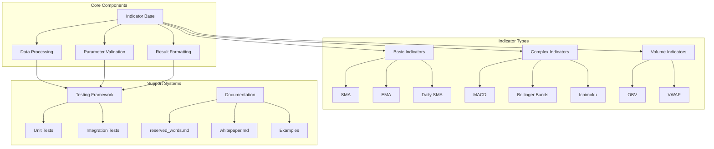

# Project Hamburg Code Preservation Charter

---

## Executive Summary

**Project Hamburg Research Inc** introduces a reproducible, open-source template and methodology for the *preservation, translation, and modernization of legacy algorithmic trading code libraries*—with a focus on proprietary scripting languages (e.g. Thinkscript) into robust, transparent, and license-compliant Python packages.

This template enables researchers, independent developers, educators, and public-goods technologists to:
- Faithfully re-implement legacy code logic for continued educational access and platform interoperability,
- Ensure continual accessibility for research/LLM training,
- Provide a transparent record of algorithm provenance, parameterization, and reserved word mapping,
- Operate ethically within copyright, trademark, and patent best practice.

---

## Motivation  
Legacy scripting environments (such as Thinkscript, EasyLanguage, etc.) are at risk of obsolescence, depriving researchers and technologists of access to classic quantitative research and systematic trading methods.

Modern AI/LLM development and educational advances require canonical, well-licensed, easy-to-parse open versions of historically significant indicators and quantitative scripts.

The open-source and academic communities need both a *methodology* and a *standard* for such translation and archival, to ensure wide, long-term compatibility.

---

## Key Design Principles

### 1. **Faithful, Auditable Translation**
- Each code module is written for direct line-by-line correspondence with original legacy scripts (e.g., Thinkscript), with clear mapping of parameters and logic.
- Reserved words and important functions are cross-referenced via an included documentation index.

### 2. **Multi-Aggregation, Multi-Symbol Ready**
- The template supports multi-timeframe usage (e.g., daily-vs-minute) and cross-series logic (like relative strength or pairs) with explicit parameterization and mapping utilities.

### 3. **Preservation and Educational Use**
- All code and documentation are structured for clarity, easy inspection, and educational re-use, with full legal disclaimers about original vendor independence and attribution.

### 4. **Open-Source License Safety**
- The framework is distributed under a permissive, business-friendly license (e.g. Apache 2.0), granting contributors and end-users strong copyright,
  patent, and usage clarity.

---

## File and Folder Structure

tospylib/
│
├── __init__.py
├── enums.py         # Enum definitions for types like AverageType, AggregationPeriod, etc.
├── indicator_utils.py  # Core utility functions: moving averages, min/max, stdev, mapping helpers
├── reserved_words.md   # Collected definitions of Thinkscript reserved words/functions, with mapping notes
│
├── indicators/
│   ├── __init__.py
│   ├── simple_moving_avg.py       # Each indicator gets its own file, matching Thinkscript logic 1:1
│   ├── mov_avg_exponential.py
│   ├── daily_sma.py
│   ├── relative_strength.py
│   ├── macd.py
│   ├── bollinger_bands.py
│   ├── stochastic_fast.py
│   ├── adx.py
│   ├── ichimoku.py
│   ├── obv.py
│   ├── volume_weighted_macd.py
│   └── pivot_points.py
│
├── tests/                 # Unit and integration tests for every indicator and core utility
│   ├── __init__.py
│   ├── test_simple_moving_avg.py
│   ├── test_macd.py
│   ├── ... (other indicator-specific test modules)
│   └── test_smoke.py
│
├── examples/              # Example scripts and Jupyter notebooks for users and educators
│   └── notebook.ipynb
│
├── LICENSE                # Apache 2.0 open source license
├── NOTICE                 # Charter, vendor-disclaimer, code preservation statement
├── README.md              # Quickstart, usage, badges, and disclaimer
├── WHITEPAPER.md          # This charter/whitepaper document describing the framework & methodology
├── requirements.txt       # Python dependencies
├── setup.py               # Package installation config
└── .gitignore             # Exclude builds, venvs, caches, secrets, etc.


---

## Template Use Guidelines

1. **Translation Standards:**  
   Each indicator or tool should have:
   - Verbatim docstring outlining the original function (for line-by-line reference),
   - Fully explicit Python signatures reflecting original design (no hidden logic or magic).

2. **Reserved Words/Functions:**  
   All referenced legacy keywords, rolling/statistical methods, and aggregations are documented in `reserved_words.md`, with original text where available and a mapping note.

3. **Timeframe and Symbol Handling:**  
   Functions must always allow explicit assignment of "calculation" timeframe, "display" timeframe, and, when relevant, secondary asset/benchmark series.

4. **Testing:**  
   Each module includes at least one basic unit test and one real-world test featuring data crossing timeframes (minute, hour, day).

5. **Legal and Attribution:**  
   Each repo or code distribution must include:
   - A LICENSE set to Apache 2.0 or compatible,
   - A DISCLAIMER/NOTICE about independence from legacy vendors (Schwab/TD/thinkorswim, etc.),
   - Clear attributions per preservation best practices.

---

## For Contributors and Maintainers

- Please submit improvements via pull requests, and include explicit references for any legacy source code structure you match.
- Educational, academic, and archival usage (including LLM/model training) is explicitly encouraged.

---

## Acknowledgments

This framework and template was developed by **Project Hamburg Research Inc** under our Legacy Code Preservation Charter (2025), with inspiration from decades of academic, nonprofit, and open technology work in financial software and AI.  
Thinkscript and related terms are referenced for educational, technical, and interoperability reasons only. This project is nonprofit, independent, and unaffiliated with Schwab, TD Ameritrade, or thinkorswim.

---

## Contact

For partnership, questions, or legal clarifications:
- Project Hamburg Research Inc  
- Email: info@projecthamburg.org

---

**Let the preservation of open knowledge, algorithmic creativity, and platform compatibility continue—for all.**

## Technical Architecture



## Contributor Guidelines

### Technical Design Principles

1. **Faithful Thinkscript Translation**
   - Maintain exact parameter names and defaults
   - Preserve calculation logic
   - Document any deviations

2. **Data Processing**
   - Use pandas Series/DataFrame for input/output
   - Handle missing data consistently
   - Support multi-timeframe analysis

3. **Performance Considerations**
   - Vectorize calculations where possible
   - Minimize memory usage
   - Cache intermediate results

4. **Testing Requirements**
   - Unit tests for core functionality
   - Edge case coverage
   - Performance benchmarks
   - Comparison with Thinkscript output

### Development Workflow

1. **Indicator Development**
   ```python
   # 1. Research Thinkscript implementation
   # 2. Create indicator file
   # 3. Implement core logic
   # 4. Add type hints and docstrings
   # 5. Write tests
   # 6. Update documentation
   ```

2. **Testing Strategy**
   ```python
   # 1. Basic functionality
   def test_basic_functionality():
       # Test with simple data
       pass
   
   # 2. Edge cases
   def test_edge_cases():
       # Test with edge cases
       pass
   
   # 3. Performance
   def test_performance():
       # Benchmark against Thinkscript
       pass
   ```

3. **Documentation Standards**
   - Clear parameter descriptions
   - Usage examples
   - Performance characteristics
   - Known limitations

4. **Code Review Checklist**
   - [ ] Follows Thinkscript logic
   - [ ] Proper error handling
   - [ ] Complete test coverage
   - [ ] Updated documentation
   - [ ] Performance optimized
   - [ ] Type hints present
   - [ ] Docstrings complete

### Performance Optimization

1. **Vectorization**
   - Use pandas/numpy operations
   - Avoid loops where possible
   - Leverage built-in functions

2. **Memory Management**
   - Release unused data
   - Use appropriate data types
   - Minimize copies

3. **Caching Strategy**
   - Cache intermediate results
   - Use appropriate cache size
   - Clear cache when needed

### Quality Assurance

1. **Testing Coverage**
   - Unit tests for all functions
   - Integration tests for workflows
   - Performance tests for critical paths

2. **Documentation Quality**
   - Clear parameter descriptions
   - Usage examples
   - Edge case handling
   - Performance considerations

3. **Code Quality**
   - PEP 8 compliance
   - Type hints
   - Docstring standards
   - Error handling
