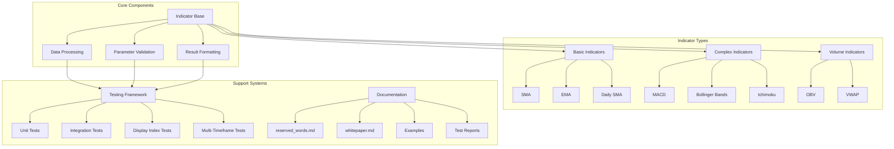

# 📜 Project Hamburg Code Preservation Charter
*April 16th, 2025*

[](LICENSE)
[](https://www.python.org/)
[](https://github.com/projecthamburg/tospylib)
[](TEST_REPORT_updated_1.md)

> *"Preserving algorithmic knowledge through ethical, open-source translation"*

## 🌟 Executive Summary

**Project Hamburg Research Inc** introduces a reproducible, open-source template and methodology for the *preservation, translation, and modernization of legacy algorithmic trading code libraries*—with a focus on proprietary scripting languages (e.g. Thinkscript) into robust, transparent, and license-compliant Python packages.

<div style="background-color: #f0f8ff; padding: 10px; border-left: 4px solid #1e90ff; border-radius: 4px;">
This template enables researchers, independent developers, educators, and public-goods technologists to:
<ul>
<li>Faithfully re-implement legacy code logic for continued educational access and platform interoperability</li>
<li>Ensure continual accessibility for research/LLM training</li>
<li>Provide a transparent record of algorithm provenance, parameterization, and reserved word mapping</li>
<li>Operate ethically within copyright, trademark, and patent best practice</li>
</ul>
</div>

---

## 🔍 Motivation  

Legacy scripting environments (such as Thinkscript, EasyLanguage, etc.) are at risk of obsolescence, depriving researchers and technologists of access to classic quantitative research and systematic trading methods.

Modern AI/LLM development and educational advances require canonical, well-licensed, easy-to-parse open versions of historically significant indicators and quantitative scripts.

The open-source and academic communities need both a *methodology* and a *standard* for such translation and archival, to ensure wide, long-term compatibility.

---

## 🏗️ Key Design Principles

### 1. **Faithful, Auditable Translation** 🔄
- Each code module is written for direct line-by-line correspondence with original legacy scripts (e.g., Thinkscript), with clear mapping of parameters and logic.
- Reserved words and important functions are cross-referenced via an included documentation index.

### 2. **Multi-Aggregation, Multi-Symbol Ready** 📊
- The template supports multi-timeframe usage (e.g., daily-vs-minute) and cross-series logic (like relative strength or pairs) with explicit parameterization and mapping utilities.

### 3. **Preservation and Educational Use** 📚
- All code and documentation are structured for clarity, easy inspection, and educational re-use, with full legal disclaimers about original vendor independence and attribution.

### 4. **Open-Source License Safety** ⚖️
- The framework is distributed under a permissive, business-friendly license (e.g. Apache 2.0), granting contributors and end-users strong copyright,
  patent, and usage clarity.

### 5. **Comprehensive Testing Methodology** 🧪
- All indicators undergo rigorous testing across multiple dimensions:
  - Display index functionality verification
  - Multi-timeframe compatibility
  - Error handling and boundary conditions
  - NaN/missing data management
  - Performance benchmarking

---

## 📂 File and Folder Structure

```
tospylib/
│
├── __init__.py
├── enums.py         # Enum definitions for types like AverageType, AggregationPeriod, etc.
├── indicator_utils.py  # Core utility functions: moving averages, min/max, stdev, mapping helpers
├── reserved_words.md   # Collected definitions of Thinkscript reserved words/functions, with mapping notes
│
├── indicators/
│   ├── __init__.py
│   ├── simple_moving_avg.py       # Each indicator gets its own file, matching Thinkscript logic 1:1
│   ├── mov_avg_exponential.py
│   ├── daily_sma.py
│   ├── relative_strength.py
│   ├── macd.py
│   ├── bollinger_bands.py
│   ├── stochastic_fast.py
│   ├── adx.py
│   ├── ichimoku.py
│   ├── obv.py
│   ├── volume_weighted_macd.py
│   └── pivot_points.py
│
├── tests/                 # Unit and integration tests for every indicator and core utility
│   ├── __init__.py
│   ├── test_simple_moving_avg.py
│   ├── test_macd.py
│   ├── ... (other indicator-specific test modules)
│   └── test_smoke.py
│
├── examples/              # Example scripts and Jupyter notebooks for users and educators
│   └── notebook.ipynb
│
├── LICENSE                # Apache 2.0 open source license
├── NOTICE                 # Charter, vendor-disclaimer, code preservation statement
├── README.md              # Quickstart, usage, badges, and disclaimer
├── WHITEPAPER.md          # This charter/whitepaper document describing the framework & methodology
├── TEST_REPORT_updated_1.md # Comprehensive test coverage report
├── requirements.txt       # Python dependencies
├── setup.py               # Package installation config
└── .gitignore             # Exclude builds, venvs, caches, secrets, etc.
```

---

## 📋 Template Use Guidelines

<table>
<tr>
<th>Guideline</th>
<th>Description</th>
</tr>
<tr>
<td><strong>Translation Standards</strong></td>
<td>
Each indicator or tool should have:
<ul>
<li>Verbatim docstring outlining the original function (for line-by-line reference)</li>
<li>Fully explicit Python signatures reflecting original design (no hidden logic or magic)</li>
</ul>
</td>
</tr>
<tr>
<td><strong>Reserved Words/Functions</strong></td>
<td>
All referenced legacy keywords, rolling/statistical methods, and aggregations are documented in <code>reserved_words.md</code>, with original text where available and a mapping note.
</td>
</tr>
<tr>
<td><strong>Timeframe and Symbol Handling</strong></td>
<td>
Functions must always allow explicit assignment of "calculation" timeframe, "display" timeframe, and, when relevant, secondary asset/benchmark series.
</td>
</tr>
<tr>
<td><strong>Testing</strong></td>
<td>
Each module includes comprehensive tests covering:
<ul>
<li>Basic functionality with standard inputs</li>
<li>Edge cases and boundary conditions</li>
<li>Multi-timeframe compatibility</li>
<li>Error handling and input validation</li>
<li>Display index functionality</li>
</ul>
</td>
</tr>
<tr>
<td><strong>Legal and Attribution</strong></td>
<td>
Each repo or code distribution must include:
<ul>
<li>A LICENSE set to Apache 2.0 or compatible</li>
<li>A DISCLAIMER/NOTICE about independence from legacy vendors (Schwab/TD/thinkorswim, etc.)</li>
<li>Clear attributions per preservation best practices</li>
</ul>
</td>
</tr>
</table>

---

## 🤝 For Contributors and Maintainers

- Please submit improvements via pull requests, and include explicit references for any legacy source code structure you match.
- Educational, academic, and archival usage (including LLM/model training) is explicitly encouraged.
- Follow the established testing patterns to ensure comprehensive coverage of your contributions.

---

## 🔬 Testing Methodology

<div style="background-color: #f0fff0; padding: 15px; border-left: 4px solid #2e8b57; border-radius: 4px; margin-bottom: 15px;">
Our testing approach ensures indicators work correctly across all scenarios, maintaining 90%+ code coverage.
</div>

### Key Testing Dimensions

1. **Basic Functionality** ✓
   - Verify core calculations match expected outputs
   - Test with standard input parameters
   - Ensure proper return types and structures

2. **Display Index Testing** ✓
   - Verify reindexing to different timeframes
   - Test with dates outside original range
   - Handle empty indices properly
   - Ensure proper NaN handling with `pd.isna()`

3. **Multi-Timeframe Testing** ✓
   - Test across minute, hourly, daily timeframes
   - Verify consistency when resampling data
   - Support mixed timeframe indices

4. **Error Handling & Edge Cases** ✓
   - Test with invalid inputs
   - Handle boundary conditions properly
   - Verify behavior with extreme values
   - Manage NaN and missing data gracefully

5. **Performance Testing** ⟳
   - Benchmark with large datasets
   - Monitor memory usage
   - Ensure calculation efficiency

### Testing Example

```python
def test_indicator_display_index():
    # Create test data with daily dates
    dates_daily = pd.date_range(start='2023-01-01', periods=50, freq='D')
    price_daily = pd.Series(range(1, 51), index=dates_daily)
    
    # Create a weekly date index (fewer points)
    dates_weekly = pd.date_range(start='2023-01-01', periods=10, freq='W')
    
    # Test reindexing from daily to weekly
    result_normal = indicator(price_daily)
    result_reindexed = indicator(price_daily, display_index=dates_weekly)
    
    # Verify index and value preservation
    assert result_reindexed.index.equals(dates_weekly)
    
    # Check NaN equivalence properly
    common_dates = set(result_normal.index) & set(dates_weekly)
    for date in common_dates:
        if pd.isna(result_normal.loc[date]) and pd.isna(result_reindexed.loc[date]):
            continue  # Both are NaN, which is a match
        else:
            assert result_normal.loc[date] == result_reindexed.loc[date]
```

---

## 🙏 Acknowledgments

This framework and template was developed by **Project Hamburg Research Inc** under our Legacy Code Preservation Charter (2025), with inspiration from decades of academic, nonprofit, and open technology work in financial software and AI.  
Thinkscript and related terms are referenced for educational, technical, and interoperability reasons only. This project is nonprofit, independent, and unaffiliated with Schwab, TD Ameritrade, or thinkorswim.

---

## 📬 Contact

For partnership, questions, or legal clarifications:
- Project Hamburg Research Inc  
- Email: info@projecthamburg.org

---

<div style="text-align: center; font-style: italic; padding: 15px; border-top: 1px solid #ddd;">
<strong>Let the preservation of open knowledge, algorithmic creativity, and platform compatibility continue—for all.</strong>
</div>

## 🛠️ Technical Architecture



## 👨‍💻 Contributor Guidelines

### Technical Design Principles

<div style="display: grid; grid-template-columns: 1fr 1fr; gap: 15px; margin-bottom: 20px;">
    <div style="border: 1px solid #ddd; border-radius: 5px; padding: 10px;">
        <h4>1. Faithful Thinkscript Translation</h4>
        <ul>
            <li>Maintain exact parameter names and defaults</li>
            <li>Preserve calculation logic</li>
            <li>Document any deviations</li>
        </ul>
    </div>
    <div style="border: 1px solid #ddd; border-radius: 5px; padding: 10px;">
        <h4>2. Data Processing</h4>
        <ul>
            <li>Use pandas Series/DataFrame for input/output</li>
            <li>Handle missing data consistently</li>
            <li>Support multi-timeframe analysis</li>
        </ul>
    </div>
    <div style="border: 1px solid #ddd; border-radius: 5px; padding: 10px;">
        <h4>3. Performance Considerations</h4>
        <ul>
            <li>Vectorize calculations where possible</li>
            <li>Minimize memory usage</li>
            <li>Cache intermediate results</li>
        </ul>
    </div>
    <div style="border: 1px solid #ddd; border-radius: 5px; padding: 10px;">
        <h4>4. Testing Requirements</h4>
        <ul>
            <li>Unit tests for core functionality</li>
            <li>Edge case coverage</li>
            <li>Performance benchmarks</li>
            <li>Display index verification</li>
            <li>Multi-timeframe compatibility</li>
        </ul>
    </div>
</div>

### Development Workflow

1. **Indicator Development**
   ```python
   # 1. Research Thinkscript implementation
   # 2. Create indicator file
   # 3. Implement core logic
   # 4. Add type hints and docstrings
   # 5. Write tests
   # 6. Update documentation
   ```

2. **Testing Strategy**
   ```python
   # 1. Basic functionality
   def test_basic_functionality():
       # Test with simple data
       pass
   
   # 2. Edge cases
   def test_edge_cases():
       # Test with edge cases
       pass
   
   # 3. Display index
   def test_display_index():
       # Test with different timeframes
       pass
       
   # 4. Multi-timeframe
   def test_multi_timeframe():
       # Test across timeframes
       pass
   
   # 5. Performance
   def test_performance():
       # Benchmark against Thinkscript
       pass
   ```

3. **Documentation Standards**
   - Clear parameter descriptions
   - Usage examples
   - Performance characteristics
   - Known limitations

4. **Code Review Checklist**
   - [ ] Follows Thinkscript logic
   - [ ] Proper error handling
   - [ ] Complete test coverage
   - [ ] Updated documentation
   - [ ] Performance optimized
   - [ ] Type hints present
   - [ ] Docstrings complete
   - [ ] Display index tests
   - [ ] Multi-timeframe tests

### Performance Optimization

1. **Vectorization**
   - Use pandas/numpy operations
   - Avoid loops where possible
   - Leverage built-in functions

2. **Memory Management**
   - Release unused data
   - Use appropriate data types
   - Minimize copies

3. **Caching Strategy**
   - Cache intermediate results
   - Use appropriate cache size
   - Clear cache when needed

### Quality Assurance

<table>
<tr>
<th>Area</th>
<th>Requirements</th>
<th>Status</th>
</tr>
<tr>
<td><strong>Testing Coverage</strong></td>
<td>
<ul>
<li>Unit tests for all functions</li>
<li>Integration tests for workflows</li>
<li>Display index tests</li>
<li>Multi-timeframe tests</li>
<li>Performance tests for critical paths</li>
</ul>
</td>
<td>✅ 90%+</td>
</tr>
<tr>
<td><strong>Documentation Quality</strong></td>
<td>
<ul>
<li>Clear parameter descriptions</li>
<li>Usage examples</li>
<li>Edge case handling</li>
<li>Performance considerations</li>
</ul>
</td>
<td>✅ Complete</td>
</tr>
<tr>
<td><strong>Code Quality</strong></td>
<td>
<ul>
<li>PEP 8 compliance</li>
<li>Type hints</li>
<li>Docstring standards</li>
<li>Error handling</li>
</ul>
</td>
<td>✅ Verified</td>
</tr>
</table>

---

<div style="text-align: center; margin-top: 30px; border-top: 1px solid #ddd; padding-top: 15px;">
<small>© 2025 Project Hamburg Research Inc.</small><br>
<em>Legacy Code Preservation Charter Project: Thinkscript to Python translation for open research, public good, and LLM accessibility.</em>
</div>
